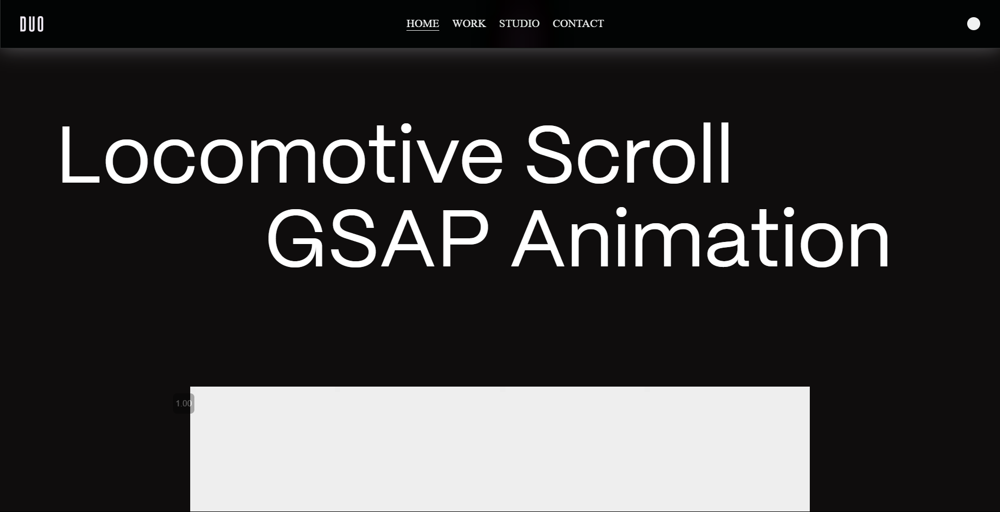
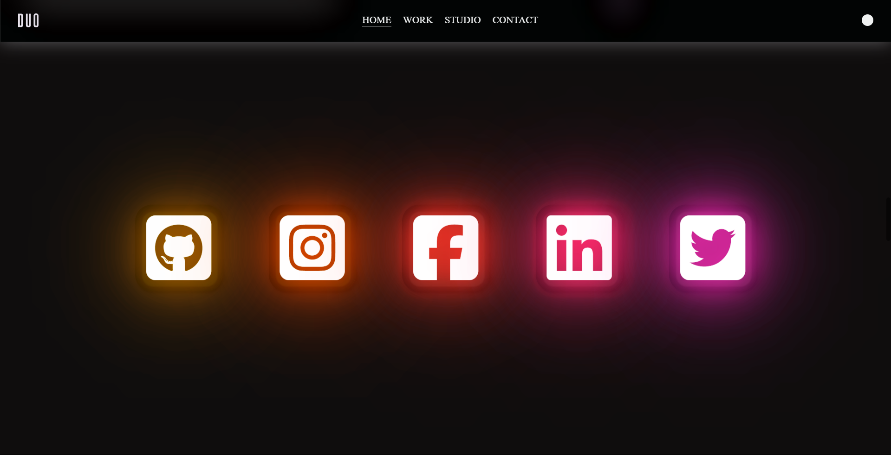
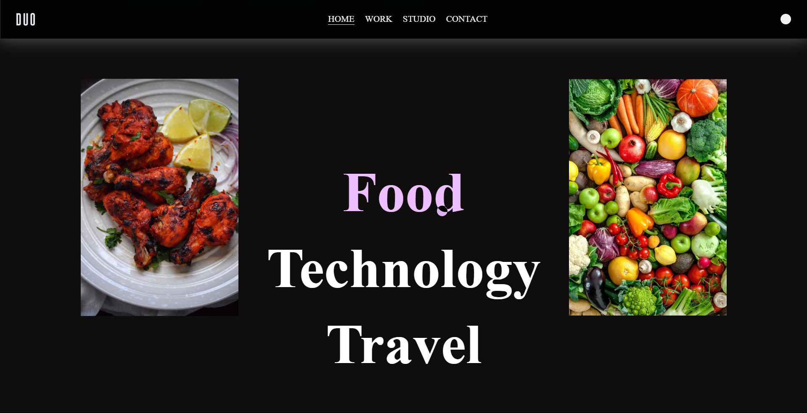
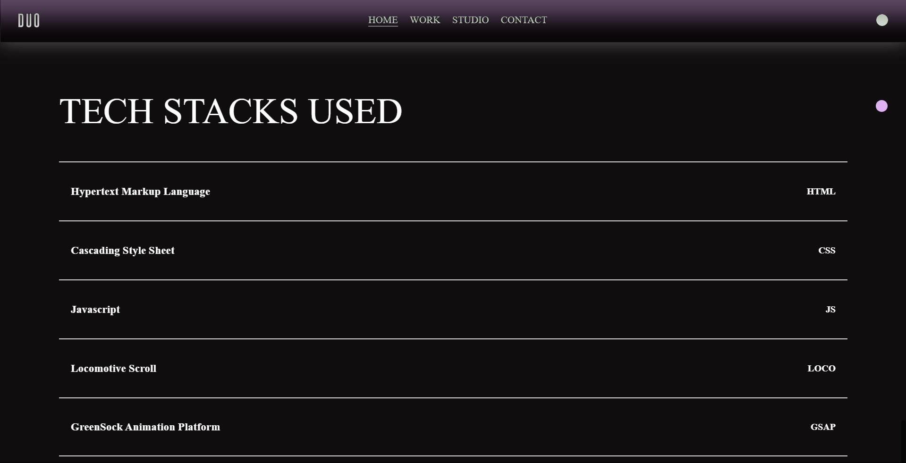

# Locomotive Scroll & GSAP Animation Project

This project demonstrates a visually stunning and interactive webpage created using **Locomotive Scroll**, **GSAP (GreenSock Animation Platform)**, and **HTML/CSS/JavaScript**. The webpage features smooth scrolling, animations, and modern design aesthetics.

---

## Features

- **Smooth Scrolling:** Powered by [Locomotive Scroll](https://locomotivemtl.github.io/locomotive-scroll/).
- **Animations:** Integrated with [GSAP](https://greensock.com/) for dynamic and engaging animations.
- **Responsive Design:** Ensures compatibility across various devices and screen sizes.
- **Custom Cursor:** Adds an interactive cursor to enhance user experience.
- **Multimedia:** Includes videos and images for an immersive visual experience.
- **Social Media Links:** Direct links to social platforms.
- **Tech Stack Showcase:** Highlights the technologies used in the project.

---

## Prerequisites

Ensure you have the following tools installed:

- A modern web browser (e.g., Google Chrome, Firefox, Safari).
- A code editor like [Visual Studio Code](https://code.visualstudio.com/).

---

## Getting Started

### 1. Clone the Repository

```bash
https://github.com/yourusername/yourrepository.git
```

### 2. Navigate to the Project Directory

```bash
cd yourrepository
```

### 3. Open the Project in Your Code Editor

```bash
code .
```

### 4. Open the `index.html` File

Launch the `index.html` file in your preferred browser to view the project.

---

## File Structure

```plaintext
project-directory
├── index.html       # Main HTML file
├── style.css        # Custom CSS styles
├── script.js        # JavaScript for animations and interactions
├── assets/          # Folder for images and videos (if applicable)
```

---

## Dependencies

### CSS Libraries

- **Locomotive Scroll:** Smooth scrolling effect.
  ```html
  <link rel="stylesheet" href="https://cdn.jsdelivr.net/npm/locomotive-scroll@3.5.4/dist/locomotive-scroll.css">
  ```

- **Font Awesome:** Icons for social media links.
  ```html
  <script src="https://kit.fontawesome.com/063796c604.js" crossorigin="anonymous"></script>
  ```

### JavaScript Libraries

- **GSAP Core Library:** For creating animations.
  ```html
  <script src="https://cdnjs.cloudflare.com/ajax/libs/gsap/3.12.2/gsap.min.js"></script>
  ```

- **GSAP ScrollTrigger Plugin:** To trigger animations during scrolling.
  ```html
  <script src="https://cdnjs.cloudflare.com/ajax/libs/gsap/3.12.2/ScrollTrigger.min.js"></script>
  ```

- **Locomotive Scroll JS:** Smooth scrolling functionality.
  ```html
  <script src="https://cdn.jsdelivr.net/npm/locomotive-scroll@3.5.4/dist/locomotive-scroll.js"></script>
  ```

---

## Usage

1. **Smooth Scrolling:** Achieved using Locomotive Scroll. Initialize it in `script.js`.
2. **Animations:** Add animations with GSAP and control them using ScrollTrigger.
3. **Social Media Links:** Replace placeholders with your social profile links.

---

## Screenshots





---

## Contributing

Feel free to fork this project and submit pull requests. Contributions are welcome!

---

## License

This project is licensed under the MIT License. See the [LICENSE](LICENSE) file for details.

---

## Author
Abhinav Kumar
Connect with me on:

---

Enjoy scrolling and animating!
